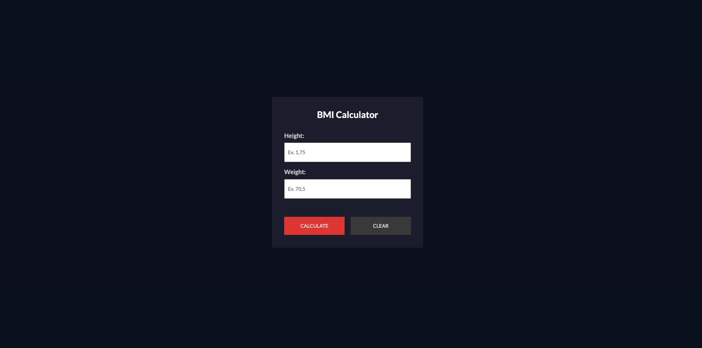

# BMI Calculator Web App
 I'm thrilled to introduce my BMI Calculator Web App project, a result of my dedicated coursework in HTML, CSS, and JavaScript. 📊💻

Project Overview:
As a passionate learner, I embarked on the journey to develop a user-friendly Body Mass Index (BMI) Calculator web application as part of my comprehensive web development course. This tool empowers users to swiftly assess their BMI and gain valuable insights into their health status by inputting their height and weight.

Key Features:  
📏 User-Friendly Interface: The web app features an intuitive design, making it easy for users to enter their height and weight values.

🔢 Precise Calculations: The BMI calculations are meticulously accurate, taking into consideration both height and weight inputs.

📈 Informative Feedback: Users receive instant feedback on their BMI, along with a classification that indicates whether they are underweight, within a healthy weight range, overweight, or facing obesity.

🌈 Visual Indicators: Results are color-coded for quick understanding—ranging from green (healthy) to red (severe obesity).

💡 Educational Resources: An information section educates users about BMI classifications, enhancing their health awareness.

Technologies Utilized:

HTML5
CSS3
JavaScript
Integration of Google Fonts for a modern and appealing typography
Project Impact:
The BMI Calculator Web App not only reinforces my practical skills in web development but also underscores my commitment to continuous learning and self-improvement. It's my aspiration that this project inspires others to explore the world of web development and health awareness.

Try It Out:
Experience the BMI Calculator Web App and gain insights into your health status

 

 
<h3><a href="#" target="_blank">Explore our Project</a></h3>

